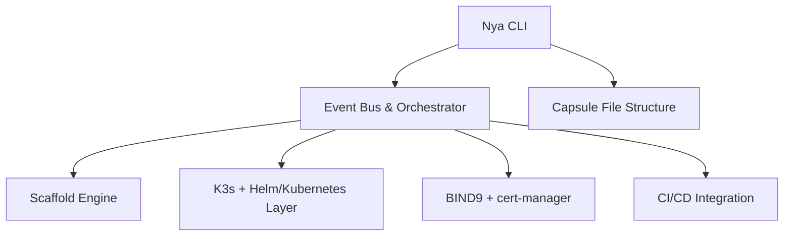

# 🌌 Nya 

Nya is an open-source CLI, application framework and toolkit for building self-hosted, container-based PaaS using a bring-your-own-compute model. It wraps around Rancher K3s, BIND9, Docker, and Helm to provide an opinionated but extensible developer experience. At the same time, Nya opts to remain neutral and modular in its operation. Whether you're working on a brand new startup idea, or spinning up a new testing environment in an enterprise company, Nya can always be an option without being a boundary. 

---

## 🚀 Overview

Nya allows developers to:

- Scaffold Kubernetes-ready apps using a capsule/pack abstraction
- Automate deployments with Helm and K3s
- Set up infrastructure (DNS, registry, TLS, DB) via Ansible
- Extend the platform through schema-driven configs and event-driven modules

---

## 🧩 Core Concepts

### Base

`coming soon` 


### 🧪 Capsule

A **Capsule** is a collection of deployable components (packs). It represents a full application group.

Example:

```json
{
  "name": "my-capsule",
  "packs": [
    { "name": "frontend", "type": "frontend", "dir": "./frontend" },
    { "name": "api", "type": "backend", "dir": "./api" }
  ]
}
```

### 📦 Pack

A **Pack** is a single deployable unit, like a frontend app, backend service, worker, or job.

Pack types:
- `frontend`
- `backend`
- `fullstack`
- `job`
- `worker`

## 🧱 Platform Architecture


## 🛠️ CLI Tasks

### `Nya create`

Create capsule or pack file structure with:

- `values.yaml`
- `Dockerfile`
- `Jenkinsfile`
- `Nya.json`

Supports application types: `frontend`, `backend`, `fullstack`, `job`, `worker`.

### `Nya up`

Deploy a capsule via Helm:

```sh
sudo helm upgrade --install <capsule-name> <path> --kubeconfig /etc/rancher/k3s/k3s.yaml
```

### `Nya down`

Tear down capsule:
```sh
sudo helm uninstall <capsule-name> --kubeconfig /etc/rancher/k3s/k3s.yaml
```

### `Nya status`

Get current state of deployed applications and capsule metadata.

### `Nya deploy-cloud`

Provision entire cluster stack with Ansible:

- K3s setup
- Private Docker Registry
- PostgreSQL database
- cert-manager
- BIND9 DNS

## 🔌 Internal Modules

| Module            | Purpose                                   |
| ----------------- | ----------------------------------------- |
| `scaffold-engine` | File + structure generator                |
| `helm-runner`     | Abstracts Helm calls                      |
| `k3s-manager`     | Controls K3s context switching, detection |
| `dns-integrator`  | Handles BIND9 and DNS automation          |
| `capsule-loader`  | Parses capsule + pack definitions         |
| `event-bus`       | Decouples command logic via subscriptions |

## 📐 Schema Usage

Nya uses schema files (`Nya.json`) to:

- Define capsule/pack structure
- Configure build and deployment metadata
- Match events to handlers dynamically
- Enable WYSIWYG generation and validation

## 🌍 Example Deployment

```yaml
components:
  - name: "fooapp"
    type: "frontend"
    image:
      name: "fooapp-frontend"
      tag: "1.0.0"
    service:
      port: 80
    ingress:
      host: "fooapp"

  - name: "fooapp-api"
    type: "backend"
    image:
      name: "fooapp-backend"
      tag: "1.0.0"
    service:
      port: 80
      targetPort: 8080
    ingress:
      host: "fooapp-api"

```
```sh
helm install fooapp ./helm -n apps -f custom-values.yaml
```

## 🧠 Event Bus Design (JS Concept)

The event bus acts as a decoupled message router:
```ts
bus.on("capsule:deploy", (payload) => deployCapsule(payload))
bus.emit("capsule:deploy", { name: "my-capsule" })
```

Benefits:

- Decouples orchestration logic
- Enables parallelization and plugin support
- Supports sync or async handlers
- Easy to extend with lifecycle events

## 🛤️ Roadmap
- Add schema validation and testing
- Create plugin system for pack types
- Build local dashboard view (optional)
- Add remote deploy target support
- Add typed event payloads or schemas

## 🧪 Testing Strategy

- Unit tests for core modules (use `bun:test`)
- Snapshot tests for scaffolded files
- Integration tests for `helm`, `k3s`, `dns`
- Use native `assert` for runtime validation

## 🎯 Vision

Nya aims to make self-hosted container infrastructure:

- **Accessible**: No need to manage cloud vendors
- **Opinionated**: Best practices baked in
- **Extensible**: Developers can extend via schema + events
- **Efficient**: Smooth local development to production path
# Nya CLI Implementation Details

## Commands

1. `Nya create base`  
   Builds the Nya base:
   - Rancher K3s  
   - Docker Registry  
   - Helm  
   - BIND9  
   - All base configurations  
   - Spawns platform UI  
   - Spawns monitoring service

2. `Nya create capsule|pack`  
   Application configuration scaffolding.  
   - Creates a new capsule or pack.

3. `Nya ship`  
   - Builds application containers from capsule using Docker.  
   - Pushes to the Docker registry.

4. `Nya up|down`  
   - Spins up/down application in the cluster.

5. `Nya status`  
   - Gathers status on base and applications.
---
## `Nya create base`

1. **Get cluster info from user**  
   - Must have control plane and node  
   - Can be the same machine  
   - Must choose a dedicated domain for DNS

2. **Using Ansible scripts, SSH into base and install/configure**:
   - Rancher K3s  
   - Docker w/ registry  
   - Helm  
   - NGINX ingress  
   - BIND9  
   - mkcert or Let's Encrypt

3. **Validate cluster**

4. **Spin up monitoring UI**

---
## `Nya create capsule|pack`

1. **Get name of application from user**  
   - Also get application type from user.

2. **Scaffold new application files**

---

## `Nya ship`

1. **Verify contents in capsule**  
   - Verify `Dockerfile`, descriptors, etc.
1. **Run Docker to build Docker components**
2. **Tag and push containers to cluster**
3. **Rotate out applications**
---
## `Nya up|down`
1. **Run Helm** to spin up / tear down apps
---
## `Nya status`

`coming soon`
